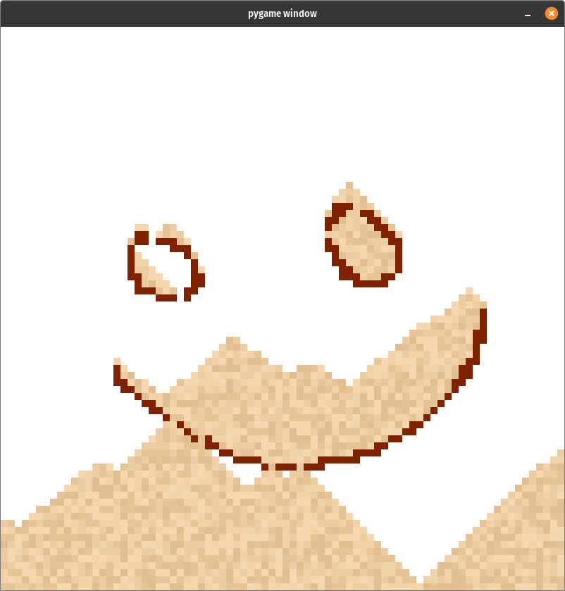
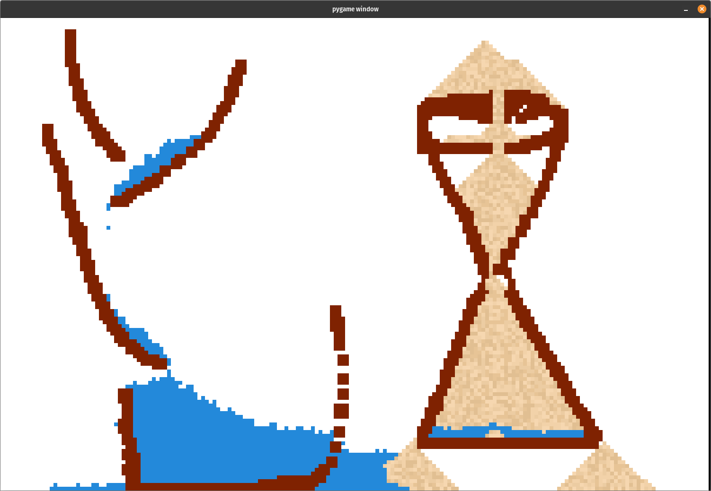
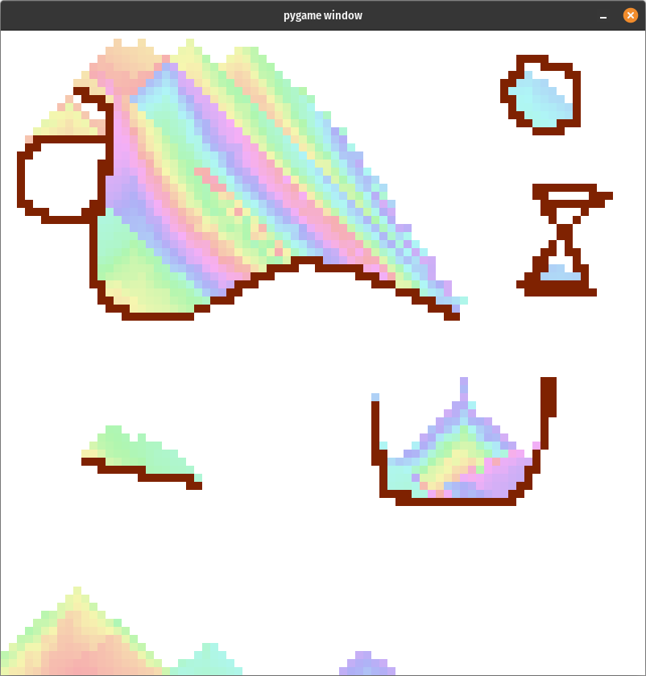

## Falling Sand

This is a **cellular automata** based simulation of sand and other particles like water and wood. Each cell in the grid can have either of four states viz. empty, sand, water and wood. Each state has its own conditions on how it interacts with other cells of the same state in its neighborhood and how the forces like the viscous force between different layers of water and gravity affect it.

## Usage

This simulation requires [pygame](https://www.pygame.org/news) to run.

## Controls

| Key            | Function   |
| -------------- | ---------- |
| `LClick`       | Draw Sand  |
| `LClick` + `w` | Draw Water |
| `LClick` + `e` | Eraser     |
| `RClick`       | Draw Wood  |

```shell
$ python main.py
```

## Screenshot

### Sand, Wood and Water




### Having Fun



## References

This [talk](https://www.youtube.com/watch?v=prXuyMCgbTc) by the developer of Noita.
